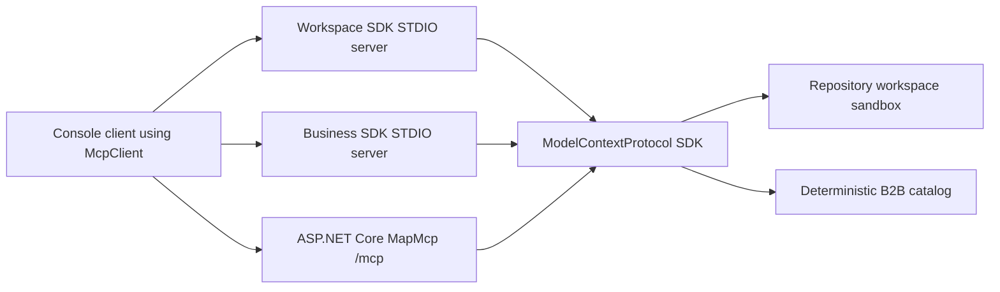

# dotnet-mcp-examples

Production-oriented .NET examples for MCP servers and clients using the official Model Context Protocol C# SDK with STDIO, Streamable HTTP, tools, resources, prompts, security controls and protocol tests.

This repository targets MCP protocol `2025-11-25` with the stable C# SDK package line `ModelContextProtocol 1.4.1`. SDK `2.0.0-rc.1` was available on 2026-07-26, but it is pre-release, so the main path stays on `1.4.1`.

## Examples

| Project | Transport | Purpose |
| --- | --- | --- |
| `McpExamples.Server.Workspace` | Official SDK STDIO | Safe workspace tools, resources and prompts over repository-owned files. |
| `McpExamples.Server.Business` | Official SDK STDIO | Deterministic B2B catalog and order operations. |
| `McpExamples.Server.Remote` | Official SDK Streamable HTTP | ASP.NET Core `/mcp` endpoint mapped with `app.MapMcp`, plus Origin validation, payload limits and rate limiting. |
| `McpExamples.Client.Console` | Official SDK STDIO and HTTP client transports | Reference CLI for doctor checks and direct MCP SDK calls. |

## Quick Start

```powershell
dotnet restore
dotnet build -c Release
dotnet test -c Release
dotnet run --project src/McpExamples.Client.Console -- doctor
```

List workspace tools through the official STDIO client/server path:

```powershell
dotnet run --project src/McpExamples.Client.Console --configuration Release -- stdio .\src\McpExamples.Server.Workspace\bin\Release\net10.0\McpExamples.Server.Workspace.exe tools
```

Run the HTTP server:

```powershell
dotnet run --project src/McpExamples.Server.Remote --configuration Release -- --urls http://127.0.0.1:5055
```

Then list remote tools through Streamable HTTP:

```powershell
dotnet run --project src/McpExamples.Client.Console --configuration Release -- http http://127.0.0.1:5055/mcp tools
```

## Architecture



## Security Defaults

The workspace server rejects absolute paths, `..`, UNC-style inputs, unsupported extensions and files outside `data/workspace`. STDIO servers configure console logging to stderr. The HTTP server validates Origin, enforces a payload limit and applies a fixed-window rate limiter before the SDK endpoint.

OAuth/OIDC is intentionally documented as a remaining hardening item in this pass; no fixed demo bearer tokens are accepted by the server.

## License

MIT
