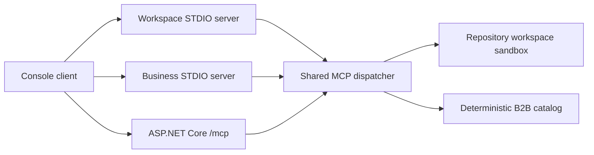

# dotnet-mcp-examples

Production-oriented .NET examples for MCP servers and clients using STDIO, Streamable HTTP, tools, resources, prompts, authorization, security and protocol tests.

This repository targets MCP protocol `2025-06-18` and the stable C# SDK package line `ModelContextProtocol 1.4.1`. SDK `2.0.0-rc.1` was available on 2026-07-26, but it is pre-release, so the main path stays on `1.4.1`.

## Examples

| Project | Transport | Purpose |
| --- | --- | --- |
| `McpExamples.Server.Workspace` | STDIO | Safe workspace tools, resources and prompts over repository-owned files. |
| `McpExamples.Server.Business` | STDIO | Deterministic B2B catalog and order operations. |
| `McpExamples.Server.Remote` | Streamable HTTP-style endpoint | ASP.NET Core `/mcp` endpoint with Origin validation, payload limits, rate limiting and bearer-scope demo authorization. |
| `McpExamples.Client.Console` | STDIO and HTTP | Reference CLI for doctor checks and direct MCP method calls. |

## Quick Start

```powershell
dotnet restore
dotnet build -c Release
dotnet test -c Release
dotnet run --project src/McpExamples.Client.Console -- doctor
```

## Architecture



## Security Defaults

The workspace server rejects absolute paths, `..`, UNC-style inputs, unsupported extensions and files outside `data/workspace`. STDIO servers log to stderr and only write JSON-RPC responses to stdout. The HTTP server validates Origin, enforces a payload limit, applies a fixed-window rate limiter and maps demo bearer tokens to explicit scopes.

This repository does not claim full MCP conformance. It includes executable protocol, security and integration tests for the implemented flows.

## License

MIT
