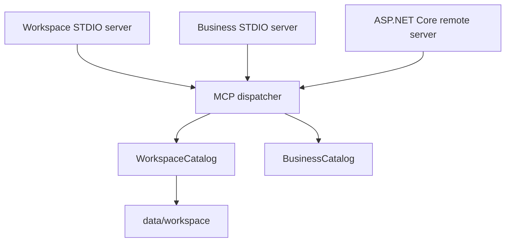

# Architecture

```mermaid
flowchart TB
  Workspace["Workspace STDIO server"] --> Dispatcher["MCP dispatcher"]
  Business["Business STDIO server"] --> Dispatcher
  Remote["ASP.NET Core remote server"] --> Dispatcher
  Dispatcher --> WorkspaceCatalog["WorkspaceCatalog"]
  Dispatcher --> BusinessCatalog["BusinessCatalog"]
  WorkspaceCatalog --> Sandbox["data/workspace"]
```

The shared dispatcher keeps protocol-facing behavior testable without coupling domain handlers to process hosting or ASP.NET Core.
